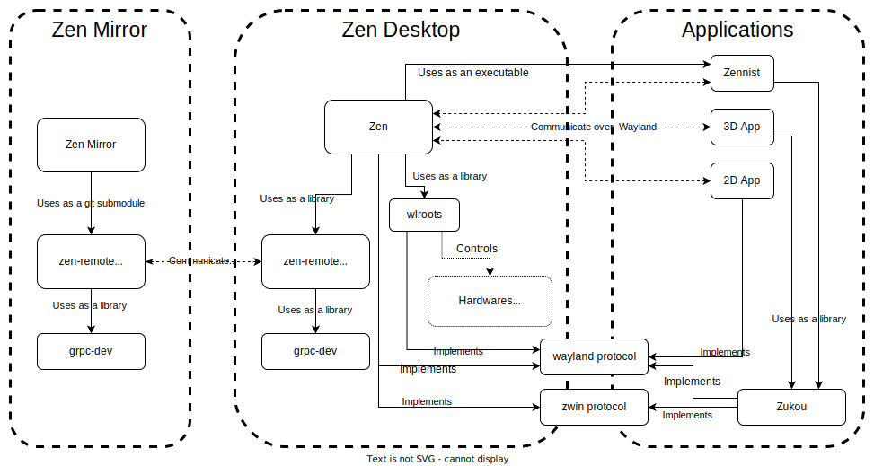

= Welcome to Zen contribution guide

Thank you for investing your time in contributing to our project!

Read our https://github.com/zwin-project/.github/blob/main/CODE_OF_CONDUCT.md[Code of Conduct]
to keep our community approachable and respectable.

See following material as well.

* https://zwin.dev/contribution[Overall contribution guide]
* https://github.com/zwin-project/.github/blob/main/CONTRIBUTING.md[Guide to submitting issues and pull requests]

== Overview

=== Level 1 : Big picture

In Zen, the following three communicate with each other to construct the system.

1. Zen +
A compositor (display server).
2. Zen Mirror +
A remote agent running on Quest 2 / Pro, that renders an immersive environment.
3. Applications +
2D and 3D applications.

Zen communicates with applications, receiving rendering information, sending
input events, etc. +
Zen and Zen Mirror communicate over the network and Zen Mirror renders
an immersive environment and presents it to the user.

[source, mermaid]
----
---
title: Big Picture
---
graph LR
%% Components
  mirror(Zen Mirror)
  zen(Zen)
  2d-app("2D App (Browser)")
  3d-app("3D App (3D Model Viewer)")

%% Relationship
  mirror <-- Network --> zen <-- Wayland --> 2d-app & 3d-app
----

=== Level 2 : Repository and library dependency

Zen consists primarily of the following repositories and libraries

* https://wayland.freedesktop.org/[Wayland] (external library) +
A base windowing system.

* https://gitlab.freedesktop.org/wlroots/wlroots[wlroots] (external library) +
A modular Wayland compositor library.

* https://github.com/zwin-project/zwin[zwin] +
Core protocols.

* https://github.com/zwin-project/zen[zen] (this repository) +
Core compositor.

* https://github.com/zwin-project/zen-mirror[zen-mirror] +
Remote agent on Meta Quest 2 / Pro.

* https://github.com/zwin-project/zen-remote[zen-remote] +
A library that implements the communication layer between
Zen running on the PC and Zen Mirror running on the HMD.
It has a client (Zen Mirror) side and a server (Zen) side implementation.

* https://github.com/zwin-project/zennist[zennist] +
A default space application of Zen.

* https://github.com/zwin-project/zukou[zukou] +
A library to build a Zwin 3D application.

.Repository and library dependency.

https://drive.google.com/file/d/1NoGWE1EHY5UVrd0lk0KV-sCUGy1w9xLJ/view?usp=sharing[diagrams.net]

== Build Zen from source

The first step in contributing to Zen by writing code is to build Zen from source.

See link:./BUILD.adoc[BUILD.adoc].

== Code convention

=== Comments

If a struct has a pointer to another struct,
annotate it with a comment as follows.

[%autowidth]
|===
|comment|semantic

|@nonnull
|The pointer must not be NULL.

|@nullable
|The pointer can be NULL.

|@outlive
|The pointer must outlive the struct that owns it.

|@owning
|The lifetime of the pointer is controlled by the struct that owns it.

|===

.Example
[source, c] 
----
struct view {
  struct surface *surface;  // @nonnull, @owning
}
----
